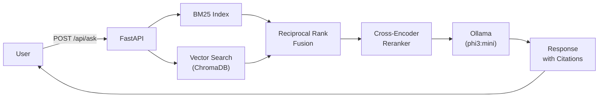

# CloudAura RAG — Ask My Docs

Production-grade Retrieval-Augmented Generation service with hybrid retrieval (BM25 + vector search), cross-encoder reranking, and citation-enforced answer generation via Ollama.

## Architecture



## Quick Start

```bash
cp .env.example .env
# edit .env with your values
docker compose up -d

# wait for Ollama to pull the model on first run
docker compose logs -f app
```

The service automatically ingests all documents from the `corpus/` directory on first startup when the vector store is empty.

## API Endpoints

| Method | Path | Description |
|--------|------|-------------|
| `GET` | `/health` | Health check — reports Ollama connectivity, vector store chunk count, embedding model |
| `POST` | `/api/ask` | Submit a question; returns answer with citations from retrieved context |
| `POST` | `/api/documents` | Ingest a new document (filename + content) into the vector store |
| `GET` | `/api/documents/stats` | Corpus statistics: total documents, chunks, model names |
| `GET` | `/metrics` | Prometheus metrics (request latency, counts, etc.) |

## Tech Stack

- **Runtime:** Python 3.12 / FastAPI 0.115 / Uvicorn
- **LLM:** Ollama (default model: `phi3:mini`)
- **Embeddings:** sentence-transformers (`all-MiniLM-L6-v2`, local)
- **Reranking:** cross-encoder (`ms-marco-MiniLM-L-6-v2`, local)
- **Vector Store:** ChromaDB (persistent, file-backed)
- **BM25:** rank-bm25 for sparse retrieval
- **Text Splitting:** langchain-text-splitters (512-token chunks, 64-token overlap)
- **Evaluation:** Ragas (faithfulness, answer relevancy, context precision, context recall)
- **Observability:** structlog (JSON), prometheus-fastapi-instrumentator
- **Testing:** pytest + pytest-asyncio

## Configuration

| Variable | Description | Default |
|----------|-------------|---------|
| `APP_HOST` | Bind address | `0.0.0.0` |
| `APP_PORT` | Application port | `8001` |
| `LOG_LEVEL` | Logging level | `info` |
| `OLLAMA_BASE_URL` | Ollama API URL | `http://ollama:11434` |
| `LLM_MODEL` | Ollama model for answer generation | `phi3:mini` |
| `EMBEDDING_MODEL` | Sentence-transformers model for embeddings | `all-MiniLM-L6-v2` |
| `RERANKER_MODEL` | Cross-encoder model for reranking | `cross-encoder/ms-marco-MiniLM-L-6-v2` |
| `CHUNK_SIZE` | Characters per text chunk | `512` |
| `CHUNK_OVERLAP` | Overlap between chunks | `64` |
| `BM25_TOP_K` | Candidates from BM25 retrieval | `20` |
| `VECTOR_TOP_K` | Candidates from vector retrieval | `20` |
| `RERANK_TOP_K` | Final results after cross-encoder reranking | `5` |
| `CHROMA_PERSIST_DIR` | ChromaDB storage path | `/app/chroma_data` |
| `CORPUS_DIR` | Directory for auto-ingestion on startup | `/app/corpus` |

## Evaluation

Run the Ragas evaluation pipeline against the live service:

```bash
cd eval
python evaluate.py
```

Produces `eval/results/eval_report.json` with per-question metrics: faithfulness, answer relevancy, context precision, and context recall.

## Testing

```bash
pytest tests/ -v
```

## Monitoring

Prometheus metrics exposed at `/metrics`. Scraped by the portfolio-wide Prometheus instance and visualized on the Grafana dashboard at `observe.cloudaura.cloud`.
